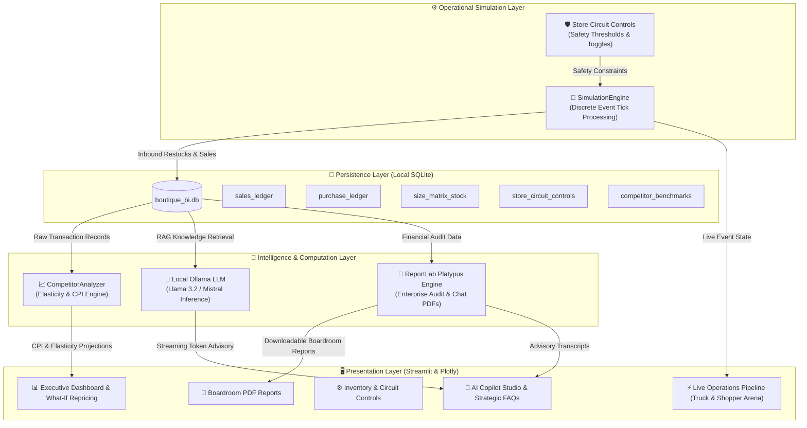

# 👗 Mishika Fashion Boutique BI Assistant
### Enterprise Local Business Intelligence, Real-Time Simulation & Privacy-First AI Copilot

An autonomous, boardroom-grade retail intelligence platform engineered for luxury apparel boutiques. Built entirely with **Streamlit**, **SQLite**, **Plotly**, **ReportLab**, and **Local Ollama (Llama 3.2 / Mistral)** for 100% offline data computation, zero third-party cloud exposure, and complete customer privacy.

---

## 🏛️ System Architecture & Data Flow



---

## 📦 Clean Project Directory Structure

```text
local_bi_boutique_assistant/
│
├── 📂 src/                                 # 📦 Production Python package
│   ├── core/                               # System configuration, paths, logger & master catalog
│   ├── data/                               # SQLite Data Access Layer & schema bootstrapping
│   ├── analytics/                          # Competitor elasticity, inventory, marketing & sentiment
│   ├── simulation/                         # Live discrete event simulation (POS sales & restocks)
│   ├── ai/                                 # Local Ollama RAG engine, personas & prompt synthesis
│   ├── reporting/                          # ReportLab Platypus boardroom PDF & transcript builder
│   └── ui/                                 # Presentation styles, CSS tokens & Lottie animations
│
├── 📂 storage/                             # 💾 Persistent data & outputs (git-ignored)
│   ├── db/boutique_bi.db                   # Active production SQLite database
│   └── exports/                            # Generated boardroom PDFs & chat transcripts
│
├── 📂 logs/                                # 📝 Application logs (rotated utf-8 streams)
│   └── app.log                             # Runtime transactions & diagnostics
│
├── 📂 tests/                               # 🧪 Automated Test Suite (7 unit tests)
│   ├── conftest.py                         # Pytest fixtures & isolated in-memory databases
│   ├── test_competitor.py                  # Price elasticity & CPI metrics verification
│   ├── test_database.py                    # SQLite ACID ledgers & catalog repricing
│   └── test_pdf_export.py                  # ReportLab flowables & transcript generation
│
├── app.py                                  # 🚀 PRIMARY APPLICATION: Modernized Streamlit entrypoint
├── app1.py                                 # 🏛️ Streamlit application (maintained for continuity)
├── run_tests.py                            # 🧪 1-Click test runner (uses standard library unittest)
├── run.bat                                 # ⚡ Windows Command Prompt 1-Click Launcher
├── run.ps1                                 # ⚡ Windows PowerShell 1-Click Launcher
├── .gitignore                              # 🛡️ Git exclusion rules (.db, .log, .pdf, .venv)
├── requirements.txt                        # 📋 Dependencies (Streamlit, Plotly, ReportLab, Ollama)
└── README.md                               # 📖 Comprehensive System Documentation
```

---

## 🔍 Module-by-Module Technical Breakdown

### 1. `app1.py` — Unified Operations & AI Command Center
- **Module 1: 📊 Executive Strategy Dashboard**
  - High-level financial scorecard (Revenue, Realized Gross Margin %, Size Curve Gaps).
  - Compact 2x2 diagnostics: Product Sales Velocity, Customer Category Sentiment, and Critical Size Curve Alerts.
  - **🏬 Competitor Intelligence & What-If Repricing Suite**: Grouped Plotly multi-competitor comparison chart, category filtering, and an interactive **Price Elasticity Simulator** with one-click catalog repricing.
  - Embedded Boutique AI Copilot with instant prompt chips and PDF transcript export.
- **Module 2: ⚡ Live Store Operations Pipeline**
  - Real-time discrete-event ingestion loop (procurement restocks and shopper checkouts).
  - Ultra-compact luxury KPI status strip (~52px) displaying live revenue, low stock alerts, and transaction statuses.
  - Animated Operations Arena featuring smooth transit animations for delivery trucks and luxury shoppers.
  - Dynamic Warehouse Stock bar chart with **selective inventory diff updating** (zero screen redraw when inventory is stable, real-time color highlighting for active events).
- **Module 3: ⚙️ Inventory & Circuit Controls**
  - Master circuit control switchboard to enable/disable sales or restocks per product style.
  - Maximum stock capacity ceiling enforcement to prevent warehouse overfilling.
  - Granular size-matrix stock inspection across core sizes (S, M, L, XL).
- **Module 4: 📄 Executive PDF Reports**
  - Multi-horizon audit generation: Daily, Weekly, Monthly, or Complete All-Time.
  - Live on-screen scorecard preview and one-click boardroom PDF compilation.
- **Module 5: 🤖 AI Copilot Studio**
  - Full-screen strategic workstation with persona switcher (Merchandise Director, Pricing Strategist, Styling Curator).
  - **Live Store Knowledge Inspector**: Real-time visual cards displaying the exact database metrics fed into LLM prompts.
  - **Strategic Retail FAQs Explorer**: Tabbed repository across 4 strategic pillars (Financials, Inventory, Pricing, Sentiment).
  - **Executive AI Strategic Audit Generator**: Synthesizes live ledgers into a 4-part executive audit narrative via local Ollama and embeds it directly into downloadable PDFs.

### 2. `database_manager.py` — Persistence & Analytics Layer
- Manages 5 core SQLite tables: `sales_ledger`, `purchase_ledger`, `size_matrix_stock`, `store_circuit_controls`, and `competitor_benchmarks`.
- **Self-Healing Schema**: Automatically checks and verifies database tables upon startup.
- **Analytical Metrics**: Calculates Sell-Through Rate (STR), Broken Size Curves (missing S/M/L with stranded volume), Average Realized Gross Margin, and latest-snapshot competitor price indexing.
- **Active Repricing Sync**: Implements `update_catalog_price()` to persist executive price adjustments made in the What-If simulator.

### 3. `simulation_engine.py` — Discrete Event Engine
- **Procurement Logistics**: Checks circuit controls (`purchase_enabled`, `max_stock`) and dispatches supplier shipments to replenish low-stock styles.
- **Retail Transactions**: Simulates shopper buying behavior with discretionary flash sale markdowns (0%–50%) and decrements inventory in real-time.
- **Realistic Competitor Volatility**: Periodically updates market prices across 3 defined competitor brand tiers:
  - *Velvet & Vine Boutique* (Luxury Tier: +15% to +35%)
  - *Avenue Apparel* (Contemporary Mid-Tier: -5% to +8%)
  - *Minimalist Thread Co.* (Fast Fashion / Budget: -15% to -30%)

### 4. `competitor_analysis.py` — Pricing Intelligence & Elasticity Core
- **Store CPI Metrics**: Computes aggregate Store Competitor Price Index, Underpriced Hazard count, and unearned monthly margin upside ($).
- **Fashion Category Price Elasticity of Demand**:
  $$\% \Delta \text{Volume} = E_{\text{category}} \times \% \Delta \text{Price}$$
  - Outerwear ($E = -1.10$), Knitwear ($E = -1.25$), Dresses ($E = -1.35$), Bottoms ($E = -1.40$), Tops ($E = -1.55$).
- Models projected units, revenue, gross profit delta, and new market position before applying repricing actions.

### 5. `insight_generator_ollama.py` — Local LLM & RAG Engine
- **Zero Cloud Dependence**: Directly connects to local Ollama server (`http://localhost:11434`) using `ollama-python`.
- **Dynamic RAG Context Builder**: Synthesizes real-time revenue, margins, hot sellers, dead stock, safety stock alerts, broken size curves, and competitor pricing spreads into high-density Markdown prompts.
- **Token-by-Token Streaming**: Streams assistant responses seamlessly using `ollama.chat(stream=True)`.
- **Executive Audit Commentary**: Autonomous synthesis of multi-horizon store performance into 4 structured boardroom sections.

### 6. `pdf_generator.py` — Boardroom Report & Transcript Compiler
- Built on **ReportLab Platypus** (Page Layout and Typography Using Scripts).
- **Custom `NumberedCanvas`**: Computes total pages dynamically in a two-pass layout for clean `Page X of Y` headers and footers.
- **Platypus Flowable Architecture**: Prevents layout overflow by wrapping cards and messages into auto-paginating flowables.
- **Executive Elements**: Branded letterhead (`Mishika Fashion LUXURY BOUTIQUE`), 4-card KPI scorecards, audited transaction tables, color-coded Underpriced Hazards, and certified sign-off blocks.

---

## 🛠️ Installation & Setup Guide

### Step 1: Clone Repository & Setup Virtual Environment
```powershell
# Navigate to project directory
cd c:\Users\akhil\Downloads\local_bi_boutique_assistant

# Create Python virtual environment (if not already present)
python -m venv .venv

# Activate virtual environment
.\.venv\Scripts\Activate.ps1
```

### Step 2: Install Python Dependencies
```powershell
pip install -r requirements.txt
```

### Step 3: Install & Start Ollama
1. Download Ollama from [ollama.com](https://ollama.com) and install it.
2. Ensure Ollama is running in the background.
3. Pull the recommended local models:
```powershell
ollama pull llama3.2:3b
ollama pull mistral:latest
```

### Step 4: Initialize SQLite Database
```powershell
.\.venv\Scripts\python.exe init_db.py
```

### Step 5: Launch the Application
```powershell
.\.venv\Scripts\python.exe -m streamlit run app1.py
```

---

## 🧪 Verification & Automated Testing

To verify all system components end-to-end, execute the test suite:
```powershell
# Verify syntax compilation across all 6 core files
.\.venv\Scripts\python.exe -c "import py_compile; files = ['database_manager.py', 'simulation_engine.py', 'competitor_analysis.py', 'insight_generator_ollama.py', 'pdf_generator.py', 'app1.py']; [py_compile.compile(f, doraise=True) for f in files]; print('ALL 6 MODULES VERIFIED 100% OK!')"

# Run end-to-end integration test (DB, CPI, Elasticity, PDF, and Ollama RAG)
.\.venv\Scripts\python.exe -c "import sys; sys.path.insert(0, '.'); from database_manager import DatabaseManager; from competitor_analysis import CompetitorAnalyzer; from pdf_generator import generate_enterprise_pdf; from insight_generator_ollama import LocalOllamaBoutiqueAnalyst; db = DatabaseManager(); df = db.fetch_dynamic_competitor_pricing(); print(f'1. Competitor DF rows: {len(df)}'); cpi = CompetitorAnalyzer.get_store_cpi_metrics(df); print(f'2. Store CPI: {cpi[\"store_cpi\"]}% | Hazards: {cpi[\"underpriced_count\"]}'); sim = CompetitorAnalyzer.simulate_price_elasticity('P002', 75.0, 84.0, 25.0, 40, 'Bottoms', 87.0); print(f'3. Elasticity Delta: ${sim[\"profit_delta\"]:+.2f}'); pdf = generate_enterprise_pdf(db, 'weekly'); print(f'4. PDF Bytes: {len(pdf):,}'); a = LocalOllamaBoutiqueAnalyst(); ctx = a.build_live_boutique_context(db); print(f'5. RAG Context CPI: {ctx.get(\"store_cpi\")}%'); print('ALL TESTS PASSED!')"
```

---

## 🔒 Privacy & Compliance
- **100% On-Premises Execution**: No customer purchase records, costs, or inventory quantities ever leave your local machine.
- **Offline LLM Inference**: All AI reasoning is executed strictly on your local CPU/GPU using Ollama.
- **Audit Certification**: All generated PDF reports reference authenticated transaction hashes and verifiable SQLite ledgers.
