# 👗 Mishika Fashion Boutique BI Assistant
### Enterprise Local Business Intelligence, Real-Time Simulation, Boutique Portal & Shivi Deep Agent

An autonomous, boardroom-grade retail intelligence and operations platform engineered for luxury apparel boutiques. Built with **Streamlit**, **SQLite**, **Plotly**, **ReportLab**, **Local Ollama (Llama 3.2 / Mistral)**, and **Shivi Deep Agent** for 100% on-premises computation, zero cloud data leaks, and autonomous customer & administrative communications.

---

## 🏛️ System Architecture & Data Flow

```mermaid
flowchart TD
    subgraph UI_Layer ["🖥️ Presentation Layer (Streamlit & Plotly)"]
        M1["📊 Executive Dashboard & What-If Repricing"]
        M2["⚡ Live Operations Pipeline (Truck & Shopper Arena)"]
        M3["📦 Boutique Operations Portal (Transfers, Products, Orders, Campaigns)"]
        M4["👥 VIP Customer Directory & CRM (20 Seeded VIPs & Attribution)"]
        M5["🧠 Shivi Deep Agent Command Center (HITL, Sandbox, Previews)"]
        M6["⚙️ Inventory & Circuit Controls"]
        M7["📄 Boardroom PDF Reports"]
        M8["🤖 AI Copilot Studio & Strategic FAQs"]
    end

    subgraph Deep_Agent ["🧠 Shivi Enterprise Deep Agent"]
        ORCH["Shivi Master Orchestrator"]
        PLAN["Hierarchical Planner & Todo Tracker"]
        SUB_REP["Reporting Subagent (Opening/Closing PDFs)"]
        SUB_TRD["Trend Hunter Subagent (Mishika Fashion News)"]
        SUB_CMP["Campaign Dispatch Subagent (VIP Blasts)"]
        SUB_INV["Inventory Watchdog (Back-in-Stock Alerts)"]
        ENV["Tool Registry & Python Sandbox"]
        GR["Guardrails (PII Shield & 50% Discount Cap)"]
        ST["HITL Steering Approval Queue"]
        DELIV["Automated Delivery (Gmail SMTP & wa.me)"]
    end

    subgraph Core_Analytics ["📈 Analytics & Simulation Engine"]
        Sim["🔄 SimulationEngine (Discrete Event POS & Customer Attribution)"]
        CA["📈 CompetitorAnalyzer (Elasticity & CPI Projections)"]
        Ollama["🦙 Local Ollama (Offline LLM Inference)"]
        PDF["📑 ReportLab Platypus Engine (Audits & Letterhead PDFs)"]
    end

    subgraph Persistence ["💾 Persistence Layer (Local SQLite)"]
        DB[(storage/db/boutique_bi.db)]
        T1["sales_ledger (13,581+ Historical Records + Customer Attribution)"]
        T2["purchase_ledger (Procurement Restocks)"]
        T3["size_matrix_stock (Shop Floor Inventory)"]
        T4["warehouse_stock (Isolated Backroom Reserve)"]
        T5["stock_transfers (Audit Trail)"]
        T6["customers (20 VIP Profiles)"]
        T7["campaigns (Marketing Directives)"]
        T8["agent_communications (Outbound Email & WhatsApp Log)"]
        T9["agent_approval_queue (HITL Steering Actions)"]
    end

    Sim -->|Customer Sales & Restocks| DB
    DB -->|Raw Ledger Records| CA
    DB -->|RAG Knowledge Retrieval| Ollama
    DB -->|Financial Audit Data| PDF
    ORCH --> PLAN
    PLAN --> SUB_REP & SUB_TRD & SUB_CMP & SUB_INV
    SUB_REP -->|Morning/Evening Audits| PDF
    SUB_REP & SUB_CMP --> DELIV
    DELIV -->|SMTP TLS| Admin["Admin Inbox (PDF Attached)"]
    DELIV -->|SMTP TLS| Clients["Customer Inboxes (HTML Newsletters)"]
    DELIV -->|wa.me| WhatsApp["WhatsApp Mobile / Web"]
    M3 -->|Transfers & Orders| DB
    M4 -->|Customer Ledgers| DB
    M5 -->|Steering & Dispatch| ORCH
```



---

## 🌟 Key Features & Capabilities

### 1. 📦 Boutique Operations Portal
- **Bidirectional Stock Transfers (Shop ⇄ Warehouse)**:
  - Move products in any quantity between the Shop Floor and Backroom Warehouse.
  - **Strict Inventory Isolation**: Warehouse items are stored in dedicated tables and *never displayed or sold on the shop floor* until explicitly transferred.
  - Live side-by-side stock comparison cards and real-time movement audit ledger (`stock_transfers`).
- **Dynamic Product Creation**:
  - Add new styles dynamically at runtime into catalog, database, and inventory reserves.
  - Configurable SKU code, style name, department, retail price, COGS, size matrix, and initial stock allocation for both shop floor and warehouse.
- **Procurement Re-Stock Ordering**:
  - Re-order any catalog item in any quantity with flexible destination routing (Shop Floor or Warehouse Reserve).
- **Custom Promotional Campaigns Hub**:
  - Launch custom campaigns with Campaign Name, Description, Discount %, Target Department, and Tagline.
  - Discount values are enforced against enterprise safety guardrails (max 50% markdown).

### 2. 👥 VIP Customer Directory & Purchase Attribution
- **20 Seeded VIP Patrons**: Complete demographic profiles with Name, Phone, Email, DOB across the 12 calendar months, Preferred Size, Gender, Style Preference tags, and Loyalty Tiers.
- **Customer Contact & Preferences Editor**:
  - Store managers can modify any client's phone number (with country code for WhatsApp dispatches), email address, preferred size, style aesthetic, loyalty tier, and notification opt-ins (WhatsApp / Email).
  - Validation ensures valid email structures and non-empty contact numbers. Updates take effect immediately across all deep agent operations.
- **Data Integrity Preservation**: All 13,581+ historical transaction records in SQLite remain untouched and pristine.
- **100% Exclusive Attribution for New Sales**:
  - The live simulation engine (`SimulationEngine.process_tick`) attributes every newly simulated purchase to one of the 20 seeded patrons.
  - `sales_ledger` captures `customer_id`, `customer_name`, `customer_email`, `customer_phone`, `size_purchased`, and `channel`.
  - Automatically updates customer lifetime spend and purchase frequency.
- **CRM Explorer**: Searchable directory cards with demographic indicators, birthday countdowns, and drill-down purchase history ledgers.

### 3. 🧠 Shivi — Enterprise AI Deep Boutique Agent
Named **Shivi**, this autonomous deep agent orchestrates multi-agent operations with 6 enterprise subsystems:
- **Autonomous Operations**:
  - **Morning Opening Briefing PDF**: Pre-opening operational audit with stock balances by location, low stock alerts, active campaigns, upcoming birthdays, and daily revenue targets.
  - **Evening Financial Closing Audit PDF**: End-of-day reconciliation with daily revenue, COGS, gross margins, customer sales ledger, and inventory transfer summary.
  - **Live Internet Fashion News with Default Fallback**:
    - Queries real-time global fashion trends directly from the internet (Google Trends & Fashion RSS feeds).
    - Weaves live runway headlines, publisher citations (Vogue, Harper's Bazaar, Elle), and direct story links into personalized client HTML emails and WhatsApp messages.
    - **Zero-Crash Fault-Tolerance Guarantee**: If the internet connection drops, times out, or encounters any error, Shivi automatically falls back to curated default luxury fashion themes with zero system disruption.
  - **Campaign Launch Broadcasts**: Crafts engaging promotional messages with unique VIP discount codes.
  - **Back-in-Stock & Restock Alerts**: Monitors inventory restocks (including recovery of zero-stock styles P016–P020) and prepares customer alert dispatches.
  - **VIP Birthday Styling Perks**: Detects upcoming client birthdays and prepares bespoke styling invitations and vouchers.
- **Enterprise Subsystems**:
  - **Execution Environment**: Modular `ToolRegistry` and a controlled `PythonSandbox` for running ad-hoc data analysis scripts.
  - **Context & Memory Store**: Episodic and semantic memory persistence (`agent_memory` table) and domain Skills Registry (`MerchandiseDirectorSkill`, `TrendCurationSkill`, etc.).
  - **Hierarchical Planning**: Multi-step todo list (`pending` $\rightarrow$ `in_progress` $\rightarrow$ `completed`) with subagent delegation.
  - **Fault Tolerance**: Retry policies with exponential backoff and deterministic fallbacks if LLMs are busy.
  - **Guardrails**: Automatic PII masking of emails/phones in logs, hard 50% promotional discount cap, and luxury brand voice compliance.
  - **Human-in-the-Loop (HITL) Steering**: Administrative approval queue for high-impact actions (mass messaging, large stock movements).

### 4. 📧 Fully Automated Email Sending (Gmail SMTP & wa.me)
- **Autonomous Gmail SMTP Delivery**:
  - Pre-configured for **Gmail TLS** (`smtp.gmail.com:587`).
  - Native support for Google **16-character App Passwords**.
  - Full **MIME multipart support** with **PDF attachments** (`MIMEApplication`), delivering boardroom reports cleanly to inboxes.
- **Boardroom PDF Reports Auto-Emailed to Admin**:
  - When Morning Opening or Evening Closing routines run, Shivi automatically emails the generated PDF audit directly to the configured admin email.
- **Autonomous Customer Email Newsletters & Campaigns**:
  - Dispatches personalized HTML emails directly to customer inboxes via SMTP.
  - Logs actual dispatch results (`Sent via Gmail SMTP` or `SMTP Error`) in SQLite `agent_communications`.
- **Dual-Mode Configuration**:
  - Visual UI Configuration under `🧠 Shivi - Enterprise Deep Agent` $\rightarrow$ `⚙️ Automated Email Setup & Testing` with a **1-click test button**.
  - Headless `.env` file configuration (using `.env.example` as a template).
- **1-Click WhatsApp (`wa.me`) & `mailto:` Direct Launchers**:
  - Test sending messages instantly in your browser on desktop or mobile without any paid API keys or registration.

---

## 📦 Project Directory Structure

```text
local_bi_boutique_assistant/
│
├── 📂 src/                                 # 📦 Production Python package
│   ├── core/                               # Master catalog (20 products) & dynamic registration
│   ├── data/                               # SQLite Data Access Layer & schema bootstrapping
│   ├── analytics/                          # Competitor elasticity, CPI metrics & sentiment
│   ├── simulation/                         # Discrete event simulation (POS sales & customer attribution)
│   ├── reporting/                          # ReportLab Platypus boardroom PDF & transcript builder
│   ├── deep_agent/                         # 🧠 Shivi Enterprise Deep Agent package
│   │   ├── orchestrator.py                 # Master ShiviDeepAgent coordinator
│   │   ├── environment.py                  # ToolRegistry & Python Analysis Sandbox
│   │   ├── context.py                      # ContextCompressor, AgentMemoryStore & SkillsRegistry
│   │   ├── planner.py                      # HierarchicalPlanner, AgentPlan & TodoItem
│   │   ├── subagents.py                    # Reporting, TrendHunter, Campaign & Inventory subagents
│   │   ├── delivery.py                     # Gmail SMTP delivery & WhatsApp wa.me launchers
│   │   ├── fault_tolerance.py              # RetryPolicy, CallBudgetTracker & Fallbacks
│   │   ├── guardrails.py                   # PIIGuardrail, DiscountSafety & BrandVoice
│   │   └── steering.py                     # Human-in-the-Loop approval queue
│   └── ui/                                 # Streamlit views, CSS luxury tokens & animations
│       ├── portal_view.py                  # Boutique Operations Portal (Transfers, Products, Orders)
│       ├── customer_crm_view.py            # VIP Customer Directory & Purchase Ledgers
│       ├── deep_agent_view.py              # Shivi Command Center (Previews, Email Setup, Sandbox)
│       └── theme.py                        # Luxury typography, cards & styling tokens
│
├── 📂 storage/                             # 💾 Persistent data & outputs (git-ignored)
│   ├── db/boutique_bi.db                   # Active production SQLite database (13,581+ transactions)
│   ├── config/email_config.json            # Local automated email settings (git-ignored)
│   └── exports/                            # Generated boardroom PDFs & chat transcripts
│
├── 📂 tests/                               # 🧪 Automated Test Suite (16 unit & integration tests)
│   ├── conftest.py                         # Pytest fixtures & isolated in-memory databases
│   ├── test_competitor.py                  # Price elasticity & CPI metrics verification
│   ├── test_database.py                    # SQLite ACID ledgers & catalog repricing
│   ├── test_pdf_export.py                  # ReportLab flowables & transcript generation
│   └── test_portal_and_agent.py            # Transfers, Products, Campaigns, CRM, Shivi & Email
│
├── app.py                                  # 🚀 PRIMARY APPLICATION: Modernized Streamlit entrypoint
├── run_tests.py                            # 🧪 1-Click test runner (16 automated tests)
├── .env.example                            # 📋 Template for automated Gmail SMTP credentials
├── .gitignore                              # 🛡️ Git exclusion rules (.db, .log, .pdf, .env, storage/config/)
├── requirements.txt                        # 📋 Dependencies (Streamlit, Plotly, ReportLab, Ollama)
└── README.md                               # 📖 System Documentation
```

---

## 🛠️ Installation & Setup Guide

### Step 1: Clone Repository & Setup Virtual Environment
```powershell
# Navigate to project directory
cd c:\Users\akhil\Downloads\local_bi_boutique_assistant

# Create Python virtual environment (if not already present)
python -m venv .venv

# Activate virtual environment
.\.venv\Scripts\Activate.ps1
```

### Step 2: Install Python Dependencies
```powershell
pip install -r requirements.txt
```

### Step 3: Install & Start Local Ollama (Optional for LLM Copilot)
1. Download Ollama from [ollama.com](https://ollama.com) and install it.
2. Ensure Ollama is running in the background.
3. Pull the recommended local models:
```powershell
ollama pull llama3.2:3b
ollama pull mistral:latest
```
*(Note: Shivi Deep Agent includes deterministic fallbacks, so the system operates smoothly even if Ollama is offline).*

### Step 4: Configure Automated Email (Optional)
To enable autonomous email dispatching via Gmail:
1. Ensure **2-Step Verification** is ON on your Google Account: [Google 2-Step Verification](https://myaccount.google.com/signinoptions/two-step-verification).
2. Generate a 16-character **Google App Password**: [Google App Passwords](https://myaccount.google.com/apppasswords) (App name: `Shivi Agent`).
3. You can either:
   - Configure it visually inside the app under **`🧠 Shivi - Enterprise Deep Agent`** $\rightarrow$ **`⚙️ Automated Email Setup & Testing`**, OR
   - Copy `.env.example` to `.env` and enter your credentials:
     ```env
     SMTP_HOST=smtp.gmail.com
     SMTP_PORT=587
     SMTP_USER=your_boutique@gmail.com
     SMTP_PASS=xxxx xxxx xxxx xxxx
     ADMIN_EMAIL=admin@yourboutique.com
     AUTO_SEND_ADMIN_AUDITS=true
     AUTO_SEND_CUSTOMER_EMAILS=true
     ```

### Step 5: Launch the Application
```powershell
$env:PYTHONIOENCODING="utf-8"
.\.venv\Scripts\streamlit.exe run app.py
```

---

## 🧭 Navigation Guide

Use the sidebar navigation in Streamlit to explore all modules:

| Navigation Item | Primary Capabilities |
| :--- | :--- |
| **📊 Executive Dashboard** | High-level financial scorecards, sales velocity, sentiment diagnostics, and interactive competitor repricing simulator. |
| **⚡ Live Store Operations** | Discrete-event simulation pipeline with transit animations for delivery trucks and shoppers, live KPI strip, and real-time inventory levels. |
| **📦 Boutique Operations Portal** | Bidirectional stock transfers (Shop ⇄ Warehouse), dynamic new product registration, procurement re-stock orders, and promotional campaign creation. |
| **👥 VIP Customer Directory & CRM** | 20 seeded VIP patron profiles, demographics, birthday countdowns, lifetime spend metrics, and historical purchase inspection. |
| **🧠 Shivi - Enterprise Deep Agent** | 1-Click operational dispatchers (Opening/Closing PDFs, Trends, Campaigns, Restocks, Birthdays), Multi-Channel Email/WhatsApp previews, automated Gmail SMTP setup with live test tool, Python sandbox, and HITL steering queue. |
| **⚙️ Inventory & Controls** | Master circuit control switchboard to pause sales or restocks per product, and set maximum stock capacity ceilings. |
| **📄 Executive PDF Reports** | Multi-horizon audit generator (Daily, Weekly, Monthly, Complete All-Time) with official corporate letterhead and certified sign-off blocks. |
| **🤖 AI Copilot Studio** | Full-screen strategic workstation with persona switcher (Merchandise Director, Pricing Strategist, Styling Curator) and RAG database context. |

---

## 🧪 Automated Testing & Verification

The test suite includes **16 comprehensive unit and integration tests** executing via standard Python `unittest`:

```powershell
$env:PYTHONIOENCODING="utf-8"
.\.venv\Scripts\python.exe run_tests.py
```

### Test Coverage Summary:
- `test_01_elasticity`: Category price elasticity and volume delta calculations.
- `test_02_cpi_structure`: Store Competitor Price Index and Underpriced Hazard detection.
- `test_03_database_initialization`: SQLite schema verification and self-healing bootstrap.
- `test_04_record_sale`: ACID sales transaction logging and stock decrementing.
- `test_05_update_catalog_price`: Runtime catalog price adjustments.
- `test_06_chat_transcript_pdf`: Copilot chat transcript PDF generation.
- `test_07_enterprise_pdf`: Executive multi-horizon audit report compilation.
- `test_08_stock_transfers`: Bidirectional stock movements between shop floor and isolated warehouse.
- `test_09_add_new_product`: Dynamic runtime product registration and sizing matrices.
- `test_10_procurement_order`: Re-stock procurement ordering with destination routing.
- `test_11_campaigns`: Promotional campaign creation and discount cap validation.
- `test_12_customers_and_attribution`: 20 VIP customers seeding and transaction attribution.
- `test_13_shivi_deep_agent`: Shivi autonomous tasks (Opening/Closing PDFs, Trends, Campaigns, Restocks, Sandbox).
- `test_14_shivi_guardrails`: PII redaction (email/phone masking), 50% discount cap, and brand voice checks.
- `test_15_shivi_steering`: Human-in-the-Loop approval queue workflow.
- `test_16_automated_email_delivery`: Automated Gmail SMTP configuration persistence, handshake testing, and PDF attachment dispatch.

---

## 🔒 Privacy, Security & Compliance
- **100% On-Premises Execution**: All customer purchase records, costs, and inventory balances remain strictly on your local machine.
- **Offline LLM Inference**: All AI reasoning is executed locally using Ollama.
- **Credential Protection**: All email passwords and `.env` files are excluded from Git via `.gitignore`.
- **PII Guardrails**: Outbound logs and telemetry automatically redact patron phone numbers and email addresses.
- **Audit Certification**: Boardroom PDF reports reference verifiable transaction records directly from SQLite.
