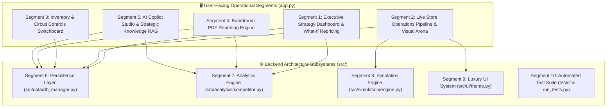

# 👗 Mishika Fashion Luxury Boutique BI Assistant
## Comprehensive System Segments & Operational Use-Case Guide

An authoritative, technical and operational breakdown of every module, subsystem, and analytical segment in the **Local BI Boutique Assistant** platform. This guide details the purpose, real-world business use cases, inputs, outputs, user workflows, and technical underpinnings of each segment.

---

## 📑 Table of Contents
1. [System Ecosystem & High-Level Architecture](#1-system-ecosystem--high-level-architecture)
2. [Segment 1: Executive Strategy Dashboard & What-If Repricing](#2-segment-1-executive-strategy-dashboard--what-if-repricing)
3. [Segment 2: Live Store Operations Pipeline & Dynamic Arena](#3-segment-2-live-store-operations-pipeline--dynamic-arena)
4. [Segment 3: Inventory & Store Circuit Controls](#4-segment-3-inventory--store-circuit-controls)
5. [Segment 4: Boardroom-Grade PDF Reporting Engine](#5-segment-4-boardroom-grade-pdf-reporting-engine)
6. [Segment 5: AI Copilot Studio & Strategic Knowledge RAG](#6-segment-5-ai-copilot-studio--strategic-knowledge-rag)
7. [Segment 6: Data Access & Persistence Layer (SQLite Engine)](#7-segment-6-data-access--persistence-layer-sqlite-engine)
8. [Segment 7: Business Intelligence & Price Elasticity Engine](#8-segment-7-business-intelligence--price-elasticity-engine)
9. [Segment 8: Discrete Event Simulation Engine](#9-segment-8-discrete-event-simulation-engine)
10. [Segment 9: Luxury UI Presentation & Design System](#10-segment-9-luxury-ui-presentation--design-system)
11. [Segment 10: Automated Testing & Deployment Tooling](#11-segment-10-automated-testing--deployment-tooling)
12. [Executive Responsibility & Operational Matrix](#12-executive-responsibility--operational-matrix)

---

## 1. System Ecosystem & High-Level Architecture

The platform is structured into **5 user-facing operational modules** backed by **5 architectural subsystem layers**. The design strictly adheres to a privacy-first, 100% offline-first philosophy where financial ledgers, inventory stock counts, and AI reasoning execute entirely on local hardware.

---

## 2. Segment 1: Executive Strategy Dashboard & What-If Repricing

### 🎯 Primary Purpose & Target Role
- **Target Audience:** Boutique Owner, Chief Merchandising Officer (CMO), Pricing Analyst.
- **Core Purpose:** Provides high-level strategic oversight of revenue, gross margins, assortment sell-through velocity, and market price positioning. Serves as the decision-support cockpit for catalog repricing.

### 💼 Business Problem It Solves
1. **Blind Underpricing:** Boutiques frequently charge 20%–35% less than regional luxury rivals without knowing it, leaving thousands in unearned gross margin on the table.
2. **Demand Uncertainty:** Store managers hesitate to raise prices for fear of killing customer demand. The simulator calculates price elasticity to prove whether a price increase generates higher total profit despite lower volume.
3. **Fragmented Assortment Insights:** Eliminates disparate spreadsheets by unifying sales velocity, customer review sentiment, and broken size curves in one view.

### 🌟 Key Features & Capabilities
- **High-Level Financial Scorecard:** Real-time authenticated tracking of *Total Sales Revenue*, *Realized Gross Margin %*, and count of *Size Curve Outages*.
- **2x2 Diagnostic Matrix:**
  - *Product Sales Velocity (STR %):* Highlights top-performing styles vs. dead-stock risks.
  - *Market Competitor Benchmark:* Visual horizontal comparison of store price index (CPI).
  - *Customer Category Sentiment:* Polarity tracking (-1.0 to +1.0) derived from shopper reviews.
  - *Critical Size Curve Alerts:* Isolates styles where core sizes (S, M, L) are missing while fringe units (XL) remain stranded.
- **Tri-Brand Multi-Competitor Matrix:** Real-time market parity benchmarking across three competitors:
  - *Velvet & Vine* (Luxury Designer: +15% to +35%)
  - *Avenue Apparel* (Contemporary Direct Peer: -5% to +8%)
  - *Minimalist Thread Co.* (Budget / Value Baseline: -15% to -30%)
- **Interactive "What-If" Price Elasticity Simulator:**
  - Dynamic slider allowing price adjustments on any catalog SKU.
  - Calculates predicted unit volume shift based on fashion category elasticity coefficients ($E_{\text{Outerwear}} = -1.10$, $E_{\text{Tops}} = -1.55$, etc.).
  - Projects monthly gross profit delta ($/month) and new market CPI.
  - **1-Click Catalog Repricing Button:** Commits the updated retail price directly to SQLite, updating live store checkout prices immediately.
- **Embedded Boutique AI Copilot Widget:** Direct access to AI streaming advisory with 1-click prompt chips and PDF transcript export.

### 📥 Inputs & Data Sources
- `sales_ledger` table (revenue, historical sale prices, COGS).
- `competitor_benchmarks` table (latest price snapshots from competitor brands).
- `size_matrix_stock` table (stock balances across S, M, L, XL).
- `src/core/catalog.py` master product definitions.

### 📤 Outputs & Business Actions
- Grouped multi-competitor bar chart and searchable pricing parity ledger.
- Price elasticity financial impact forecasts.
- Direct database update (`db.update_catalog_price()`).
- Instant chat transcript PDF export.

### 🛠️ Step-by-Step How to Use It
1. Open the portal and select **📊 Executive Dashboard** from the sidebar.
2. Review the top KPI cards: confirm total gross revenue and realized gross margin %.
3. Inspect **Critical Size Curve Gaps** on the right to see if popular styles are missing core sizes.
4. Navigate to the **Competitor Intelligence** section:
   - Click **Multi-Competitor Market Matrix** to view price bars across all three competitors.
   - Click **'What-If' Price Elasticity & Repricing Simulator**.
   - Select a flagged "Underpriced Hazard" item from the dropdown.
   - Adjust the proposed price slider upward.
   - Verify that **Monthly Gross Profit** delta is positive (e.g. `+$420.00/mo`).
   - Click **⚡ Apply Repricing to Catalog** to commit the change.

---

## 3. Segment 2: Live Store Operations Pipeline & Dynamic Arena

### 🎯 Primary Purpose & Target Role
- **Target Audience:** Store Operations Manager, Inventory Floor Supervisor, Logistics Team.
- **Core Purpose:** Real-time monitoring and simulation of live floor transactions (customer purchases) and supply chain arrivals (truck restock deliveries).

### 💼 Business Problem It Solves
1. **Inventory Blindspots:** Physical retail staff rarely see the immediate downstream impact of sales on warehouse buffer stock.
2. **Delivery Miscoordination:** Receiving docks need immediate alerts when restock shipments arrive and when shipments are blocked due to storage caps.
3. **Screen Flicker Fatigue:** Traditional BI dashboards refresh the entire canvas on every tick, causing disorienting redraws. This segment selectively renders changes with zero flicker.

### 🌟 Key Features & Capabilities
- **Ultra-Compact Luxury Status Strip (~52px):** Continuous visibility of Total Sales Revenue, Low Stock warnings count ($\le 15$ units), and active pipeline event status.
- **Hardware-Accelerated 60 FPS HTML5 Canvas Arena:**
  - *Delivery Cargo Truck:* Decelerates on road, docks at the warehouse depot, and unloads inventory crates.
  - *Luxury Shopper:* Walks into the boutique, triggers checkout sparkles, and emerges carrying boutique shopping bags.
  - *Dual Sine-Wave Liquid Tank:* Mathematically models physical fluid stock volume and wave agitation upon deliveries.
- **Selective-Update Warehouse Stock Level Chart:**
  - Updates **only** when inventory quantities change, eliminating UI redraw stutter.
  - Preserves user zoom and pan state via Plotly `uirevision`.
  - **Dynamic Event Color Highlighting:**
    - 🟢 **Emerald Green (`#10b981`):** Product that was just restocked by an incoming truck.
    - 🟡 **Amber Gold (`#f59e0b`):** Product that was just purchased by a shopper.
    - 🔴 **Crimson (`#ef4444`):** Any product operating at or below critical safety threshold ($\le 15$ units).
    - 🔵 **Luxury Slate (`#1e293b`):** Stable, unchanged catalog lines.
- **Dual Live Activity Ledgers:** Side-by-side transaction log feeds:
  - *Live Sales Log:* Customer timestamp, product name, and total revenue.
  - *Inbound Restocks Log:* Delivery timestamp, restocked unit count, and procurement cost.

### 📥 Inputs & Data Sources
- Live memory session state (`st.session_state.live_inventory`).
- Active circuit breaker controls (`st.session_state.store_controls`).
- Discrete event outputs from `SimulationEngine.process_tick()`.

### 📤 Outputs & Business Actions
- Real-time inserts into SQLite `sales_ledger` and `purchase_ledger`.
- Real-time updates to `size_matrix_stock`.
- Live visual event feedback in the animated arena and inventory chart.

### 🛠️ Step-by-Step How to Use It
1. Select **⚡ Live Store Operations** from the sidebar.
2. Configure simulation controls in the sidebar:
   - Set **Active Flash Sale Markdown (%)** if testing promotional foot traffic.
   - Adjust **Simulation Tick Speed** (default 0.35s).
3. Check **▶️ Activate Live Operations Loop** to start ingestion.
4. Watch the animated arena and observe the stock bar chart:
   - When an Amber bar appears, note the customer purchase in the left log.
   - When an Emerald bar appears, note the truck restock in the right log.
5. Uncheck the box at any time to pause the simulation in clean standby mode.

---

## 4. Segment 3: Inventory & Store Circuit Controls

### 🎯 Primary Purpose & Target Role
- **Target Audience:** Inventory Controller, Warehouse Manager, Operations Director.
- **Core Purpose:** Provides operational guardrails, stock capacity limiters, and granular size-level inspection to prevent stockouts and warehouse overfill.

### 💼 Business Problem It Solves
1. **Runaway Procurement:** Without hard capacity ceilings, suppliers often deliver excess merchandise, overloading backrooms and tying up cash flow.
2. **Accidental Selling of Reserved Stock:** Store staff need an instant switch to freeze sales of styles reserved for VIP appointments, photoshoots, or quality holds.
3. **Broken Size Run Blindness:** High aggregate stock (e.g. 30 units) often masks the fact that all Small and Medium sizes are sold out, leaving only unsellable fringe sizes.

### 🌟 Key Features & Capabilities
- **Master Circuit Switchboard:**
  - *Allow Sales Toggle:* Disables customer checkout for specific styles without removing them from the catalog.
  - *Allow Restock Toggle:* Prevents delivery trucks from replenishing designated styles.
  - *Instant Simulation Enforcement:* The simulation engine checks these switches on every tick; blocked attempts trigger explicit alert notifications.
- **Maximum Stock Capacity Ceilings:**
  - Configurable storage ceiling per SKU (e.g. 100 or 150 units).
  - Automatically rejects delivery shipments if current stock plus incoming batch exceeds the ceiling.
- **Granular Size-Matrix Stock Inspector:**
  - Tabbed breakdown by apparel category (Dresses, Tops, Bottoms, Outerwear, Knitwear).
  - Displays unit availability across Small (S), Medium (M), Large (L), and Extra Large (XL).
  - Flags broken size curves and estimates stranded fringe stock.
- **Quick-Filter Toolbar:** 1-click toggle to isolate only items with low stock ($\le 15$ units).

### 📥 Inputs & Data Sources
- `store_circuit_controls` SQLite table.
- `size_matrix_stock` SQLite table.
- Current live inventory balances.

### 📤 Outputs & Business Actions
- Immediate database updates to circuit rules (`db.update_circuit_controls()`).
- Operational warnings in the Live Operations stream when shipments or purchases are blocked.

### 🛠️ Step-by-Step How to Use It
1. Select **⚙️ Inventory & Controls** from the sidebar.
2. Use the **Show Low Stock Only** switch to see styles needing attention.
3. Navigate to a specific category tab (e.g., *Dresses*).
4. For a specific dress (e.g., *P001 - Linen Wrap Dress*):
   - Toggle **Allow Sales** OFF if reserving inventory.
   - Toggle **Allow Restock** OFF if halting supplier orders.
   - Adjust the **Max Stock** slider to enforce a strict warehouse ceiling.
5. Review the **Size Matrix Breakdown** below each card to verify unit balances across S, M, L, and XL.

---

## 5. Segment 4: Boardroom-Grade PDF Reporting Engine

### 🎯 Primary Purpose & Target Role
- **Target Audience:** Boutique Owner, Investors, CFO, External Financial Auditors.
- **Core Purpose:** Compiles formal, authenticated, boardroom-ready PDF audit documents directly from SQLite ledgers with zero manual spreadsheet export.

### 💼 Business Problem It Solves
1. **Audit Preparation Lag:** Generating financial balance sheets and procurement summaries manually takes hours and introduces human formula errors.
2. **Lack of Market Context:** Standard accounting statements show revenue and cost, but omit competitive market price parity.
3. **Executive AI Integration:** Executives want high-level synthesis and prioritized action items without reading raw transaction logs.

### 🌟 Key Features & Capabilities
- **Multi-Horizon Audit Timeframes:**
  - *Daily Audit:* 24-hour financial and transactional review.
  - *Weekly Strategic Audit:* Moving averages, replenishment spend, and velocity trends.
  - *Monthly Balance Review:* Complete monthly accounting and gross margin scorecard.
  - *Complete All-Time Audit:* Lifetime transactional audit of all sales and purchases.
- **ReportLab Platypus Engine Architecture:**
  - Structured document layout: Letterhead, Metadata, Financial KPI Scorecard, Sales Ledgers, Procurement Restocks, and Inventory Valuation.
  - Dynamic two-pass `NumberedCanvas` producing accurate "Page X of Y" footers.
  - Clean flowable pagination: tables and cards break gracefully across page boundaries with zero clipping.
- **Section 6: Market Competitor Price Benchmark Table:**
  - Embeds full competitive pricing matrix directly into the audit document.
  - Visual amber highlighting for Underpriced Hazards (CPI < 92%).
  - Provides clear prescribed actions (e.g., "Raise Price to Parity").
- **Embedded Local Ollama Strategic Commentary:**
  - Automatically synthesizes live numbers into a 4-part boardroom narrative:
    1. *Executive Summary & Financial Health*
    2. *Merchandising Velocity & Profitability Drivers*
    3. *Supply Chain Restocks & Safety Stock Safeguards*
    4. *Strategic Pricing & Boardroom Action Items (Top 3 Priorities)*

### 📥 Inputs & Data Sources
- Filtered date-bounded queries from `sales_ledger` and `purchase_ledger`.
- `competitor_benchmarks` latest price snapshots.
- `size_matrix_stock` inventory balances.
- AI commentary generated via `src/ai/ollama_client.py`.

### 📤 Outputs & Business Actions
- In-memory compiled PDF binary stream.
- 1-click browser download button (`.pdf` file).

### 🛠️ Step-by-Step How to Use It
1. Select **📄 Executive PDF Reports** from the sidebar.
2. Choose an audit timeframe (*Weekly*, *Monthly*, *Daily*, or *Complete All-Time*).
3. Review the on-screen live scorecard preview (Revenue, COGS, Gross Margin, Deliveries).
4. (Optional) Check **Generate AI Executive Commentary** to have local Ollama draft the strategic narrative.
5. Click **📑 Compile Executive PDF Audit Report**.
6. Click **📥 Download Boardroom PDF Report** to save the document.

---

## 6. Segment 5: AI Copilot Studio & Strategic Knowledge RAG

### 🎯 Primary Purpose & Target Role
- **Target Audience:** Boutique Owner, Fashion Buyer, Creative Director, Marketing Lead.
- **Core Purpose:** Dedicated AI decision-support workstation leveraging local LLMs (Ollama) with real-time Retrieval-Augmented Generation (RAG) over live store data.

### 💼 Business Problem It Solves
1. **Generic AI Hallucinations:** Standard commercial chatbots know nothing about this boutique's actual inventory levels, margins, or competitor pricing. This engine injects real-time SQLite metrics into every prompt.
2. **Cloud Data Leakage:** Eliminates the risk of leaking trade secrets, revenue, or customer reviews to third-party cloud AI vendors.
3. **Executive Decision Paralysis:** Provides persona-tailored strategic advice (Merchandise Director vs. Pricing Strategist vs. Styling Curator).

### 🌟 Key Features & Capabilities
- **100% Offline Local LLM Execution:**
  - Runs on local Ollama server (`llama3.2:3b` default, `mistral:latest` supported).
  - Zero API subscription fees, zero internet dependency, zero token billing.
- **3 Specialized Advisory Personas:**
  1. *👔 Senior Merchandise Director:* Boardroom-level retail math, sell-through rate (STR %), inventory turnover, GMROI, and cash-flow protection.
  2. *🏷️ Pricing & Margin Strategist:* Competitive price positioning, margin defense, CPI optimization, and price elasticity.
  3. *✨ Mishika Fashion & Styling Curator:* Luxury craftsmanship, customer feedback review polarity, fabric quality, and assortment harmony.
- **Live Store Knowledge Inspector:**
  - Visual cards showing the exact real-time payload retrieved from SQLite and injected into the LLM system prompt.
  - Verifies transparency: owners can see the exact numbers the AI is referencing.
- **Strategic Retail FAQs Explorer:**
  - Tabbed library across 4 key retail pillars:
    - *📈 Financials & Margins*
    - *⚠️ Inventory & Stock*
    - *🏬 Competitor Pricing*
    - *🧵 Sentiment & Quality*
  - Clicking any FAQ automatically populates the chat prompt.
- **1-Click Executive Prompt Chips:** Instant buttons for common executive audits (*Autonomous Repricing Audit*, *Top Margin Drivers*, *Broken Size Curve Risks*, *48-Hour Restock Plan*).
- **📥 Export Chat to PDF Button:** Compiles the complete multi-turn conversation into a formatted boardroom PDF with persona badges, model details, and timestamps.

### 📥 Inputs & Data Sources
- Complete live store metrics payload generated by `LocalOllamaBoutiqueAnalyst.build_live_boutique_context(db)`.
- Multi-turn conversation history (`st.session_state.copilot_messages`).
- Active persona prompt templates (`PERSONAS`).

### 📤 Outputs & Business Actions
- Token-by-token streaming AI responses in the chat interface.
- Boardroom PDF transcript downloads (`generate_chat_transcript_pdf`).

### 🛠️ Step-by-Step How to Use It
1. Select **🤖 AI Copilot Studio** from the sidebar.
2. Select your desired advisory persona from the dropdown (e.g. *Pricing & Margin Strategist*).
3. Expand **🔍 Live Store Knowledge Inspector** to view current store metrics.
4. Either:
   - Click a preset prompt chip (e.g. **🎯 Autonomous Repricing Audit**).
   - Browse the **Strategic Retail FAQs** tabs and click a question.
   - Type a custom question into the chat input bar.
5. Read the streamed analytical advice citing exact product names, quantities, and dollar gaps.
6. Click **📥 Export Chat (PDF)** to download a permanent boardroom transcript.

---

## 7. Segment 6: Data Access & Persistence Layer (SQLite Engine)

### 🎯 Primary Purpose & Architecture
- **Location:** `src/data/db_manager.py` & `src/data/seed_db.py`
- **Database Path:** `storage/db/boutique_bi.db`
- **Core Purpose:** Provides thread-safe, transactional, self-healing data persistence for all financial transactions, stock levels, competitor benchmarks, and circuit rules.

### 🗄️ Relational Schema Breakdown
| Table Name | Primary Role | Key Columns |
| :--- | :--- | :--- |
| `sales_ledger` | Immutable audit log of every customer transaction | `id`, `timestamp`, `product_id`, `product_name`, `quantity`, `unit_price`, `unit_cost`, `total_revenue`, `total_cost`, `gross_profit`, `is_promotional`, `campaign_name` |
| `purchase_ledger` | Immutable audit log of every inbound supplier restock | `id`, `timestamp`, `product_id`, `product_name`, `quantity`, `total_cost` |
| `size_matrix_stock` | Multi-variant inventory levels per size variant | `product_id`, `size_variant` (S/M/L/XL), `stock_on_hand` |
| `store_circuit_controls` | Operational switches & capacity caps per product | `product_id`, `sales_enabled` (0/1), `purchase_enabled` (0/1), `max_stock` |
| `competitor_benchmarks` | Historical and latest competitor pricing snapshots | `id`, `timestamp`, `product_id`, `product_name`, `your_price`, `competitor_name`, `competitor_price` |

### 🌟 Key Technical Capabilities
- **Self-Healing Schema Verification:** On initialization, `_verify_schema()` validates all 5 tables and automatically seeds missing tables, default sizes, and initial circuit rules.
- **Latest-Snapshot Competitor Queries:** Replaced historical averages with inner joins on `MAX(id)` per competitor to prevent variance flattening and ensure accurate market price indices.
- **Dynamic Price Synchronization:** `update_catalog_price()` updates runtime catalog dictionaries and live stock records atomically.

---

## 8. Segment 7: Business Intelligence & Price Elasticity Engine

### 🎯 Primary Purpose & Architecture
- **Location:** `src/analytics/competitor.py`, `src/analytics/inventory.py`, `src/analytics/marketing.py`, `src/analytics/sentiment.py`
- **Core Purpose:** Mathematical and economic modeling for retail pricing, inventory health, campaign returns, and review sentiment.

### 📐 Mathematical Formulations & Logic

#### 1. Retail Fashion Category Price Elasticity
Apparel categories exhibit varying degrees of price sensitivity based on consumer discretionary behavior:

$$\% \Delta Q = E_{\text{category}} \times \% \Delta P$$

$$Q_{\text{projected}} = \max\left(1, \text{round}\left(Q_{\text{base}} \times \left(1 + E_{\text{category}} \times \frac{P_{\text{new}} - P_{\text{old}}}{P_{\text{old}}}\right)\right)\right)$$

| Category | Elasticity ($E$) | Sensitivity Type | Economic Interpretation |
| :--- | :--- | :--- | :--- |
| **Outerwear** | $-1.10$ | Relatively Inelastic | High purchase deliberation, strong brand loyalty; high pricing power |
| **Knitwear** | $-1.25$ | Moderate Inelastic | Quality and material-driven (merino, cashmere); moderate flexibility |
| **Dresses** | $-1.35$ | Moderate Elastic | Event and fashion-driven; standard elasticity |
| **Bottoms** | $-1.40$ | Elastic | High market comparability (denim, trousers); sensitive to price hikes |
| **Tops** | $-1.55$ | Highly Elastic | Commodity apparel (tees, tanks); sharp demand drop if overpriced |

#### 2. Competitor Price Index (CPI)
Measures the store's overall price positioning relative to market rivals:

$$\text{CPI} = \left(\frac{\text{Our Retail Price}}{\text{Average Market Price}}\right) \times 100$$

- **Underpriced Hazard ($\text{CPI} < 92.0\%$):** We are leaving margin on the table. Prescription: Raise price toward parity.
- **Market Aligned ($92.0\% \le \text{CPI} \le 112.0\%$):** Competitive equilibrium. Prescription: Maintain price.
- **Premium Positioned ($\text{CPI} > 112.0\%$):** Luxury premium command. Prescription: Monitor sell-through velocity.

---

## 9. Segment 8: Discrete Event Simulation Engine

### 🎯 Primary Purpose & Architecture
- **Location:** `src/simulation/engine.py`
- **Core Purpose:** Generates stochastic retail transactions, customer purchases, supply chain arrivals, and competitor price fluctuations in a controllable discrete-event loop.

### ⚙️ Simulation Mechanics
1. **Tick Execution (`process_tick`):**
   - Ingests promotional markdown percentage and mutable stock dictionary.
   - Evaluates a random event roll against a dynamic sales threshold ($0.65$ baseline, up to $0.85$ during flash sales).
2. **Channel A — Customer Sales Routing:**
   - Selects a random product. Checks `store_circuit_controls`:
     - If `sales_enabled == 0`: Returns `Blocked Sale` event.
     - If stock $> 0$: Deducts 1 unit from memory stock and SQLite `size_matrix_stock`, logs to `sales_ledger`, and returns `Sale` event.
     - If stock $== 0$: Returns `Out of Stock` blocked event.
3. **Channel B — Procurement Restock Routing:**
   - Filters products with `purchase_enabled == 1` and stock below `max_stock`.
   - Prioritizes products with lowest inventory balance for replenishment.
   - Checks warehouse ceiling: if `current_stock >= max_stock`, rejects delivery and logs warning.
   - Unloads batch ($\le 20$ units), credits size matrix, logs to `purchase_ledger`, and returns `Purchase` event.
4. **Competitor Volatility Injection:**
   - Periodically fluctuates competitor prices within realistic brand tier boundaries:
     - *Velvet & Vine:* $+15\%$ to $+35\%$
     - *Avenue Apparel:* $-5\%$ to $+8\%$
     - *Minimalist Thread:* $-15\%$ to $-30\%$

---

## 10. Segment 9: Luxury UI Presentation & Design System

### 🎯 Primary Purpose & Architecture
- **Location:** `src/ui/theme.py`, `src/ui/animations.py`
- **Core Purpose:** Defines typography, custom CSS tokens, dark/light luxury styling, Plotly visualization templates, and hardware-accelerated animations.

### 🎨 Design Tokens & UI Architecture
- **Typography:** Google Fonts *Playfair Display* (Editorial Serif for headings) paired with *Inter* (Crisp sans-serif for numbers and ledger tables).
- **Palette Tokens:**
  - Deep Navy Slate: `#0f172a`
  - Luxury Amber Gold: `#d97706` / `#f59e0b`
  - Emerald Green: `#10b981` / `#059669`
  - Indigo / Royal Blue: `#2563eb` / `#4338ca`
  - Crimson Alert: `#ef4444` / `#dc2626`
- **Ultra-Compact KPI Strip:** Renders a fixed-height 52px status header visible at all screen heights.
- **Hardware-Accelerated Canvas:** Uses raw HTML5 Canvas within an isolated iframe container, using `sessionStorage` state caching across re-renders to prevent vehicle or character animation jumping.

---

## 11. Segment 10: Automated Testing & Deployment Tooling

### 🎯 Primary Purpose & Architecture
- **Location:** `tests/`, `run_tests.py`, `run.bat`, `run.ps1`
- **Core Purpose:** Guarantees platform reliability through regression test coverage and provides 1-click execution for non-technical boutique staff.

### 🧪 Automated Test Suite (`run_tests.py`)
Built using the standard Python `unittest` library (requiring zero external test runners):

| Test Case | Method Verified | Success Condition |
| :--- | :--- | :--- |
| `test_01_elasticity` | `CompetitorAnalyzer.simulate_price_elasticity` | Volume delta matches category $E$; profit delta and new CPI calculate correctly |
| `test_02_cpi_structure` | `CompetitorAnalyzer.get_store_cpi_metrics` | Returns valid `store_cpi`, hazard counts, and margin opportunities |
| `test_03_database_initialization` | `DatabaseManager._verify_schema` | All 5 SQLite tables exist and initial rows are seeded |
| `test_04_record_sale` | `DatabaseManager.save_sale` | Atomic ledger insertion and inventory retrieval execute without error |
| `test_05_update_catalog_price` | `DatabaseManager.update_catalog_price` | Live retail price updates directly in the database |
| `test_06_chat_transcript_pdf` | `pdf_builder.generate_chat_transcript_pdf` | Generates valid, non-empty `%PDF` byte stream from chat messages |
| `test_07_enterprise_pdf` | `pdf_builder.generate_enterprise_pdf` | Generates valid multi-page `%PDF` financial audit document |

### ⚡ 1-Click Launchers
- **`run.bat` (Windows Command Prompt):** Automatically detects `.venv` or `env`, activates the environment, and launches `streamlit run app.py --server.port 8501 --theme.base "dark"`.
- **`run.ps1` (Windows PowerShell):** Color-coded PowerShell launcher script.

---

## 12. Executive Responsibility & Operational Matrix

| Segment | Primary User Role | Key Daily Action | Critical Value Delivered |
| :--- | :--- | :--- | :--- |
| **Segment 1: Executive Dashboard** | Boutique Owner / CMO | Check realized gross margins; simulate & apply price adjustments | Captures thousands in unearned margin by eliminating underpricing hazards |
| **Segment 2: Live Operations** | Store Manager / Inventory Staff | Monitor live sales and incoming delivery truck restocks | Visual real-time situational awareness with zero screen lag or flicker |
| **Segment 3: Inventory Controls** | Warehouse Supervisor | Toggle sales holds; set warehouse storage capacity limits | Prevents stockouts of core sizes and rejects overfilling deliveries |
| **Segment 4: PDF Reports** | CFO / Financial Auditor | Compile Daily, Weekly, or Monthly boardroom audit PDFs | Instant boardroom audit compliance with embedded AI recommendations |
| **Segment 5: AI Copilot Studio** | Merchandising & Buying Team | Query personas on assortment velocity and export chat transcripts | Local, zero-cost, private strategic intelligence citing real database metrics |
| **Segment 6: SQLite Persistence** | System Engine / Database | Commits ACID transactional ledgers and seeds schema | Guaranteed data durability with zero external database server overhead |
| **Segment 7: Analytics Engine** | Analytics Pipeline | Calculates category elasticity, CPI indices, and sentiment | Mathematical rigour replacing gut-feeling pricing decisions |
| **Segment 8: Simulation Engine** | Testing / Operational Stream | Simulates POS sales, restocks, and competitor price moves | Realistic operational sandbox for staff training and load testing |
| **Segment 9: UI Design System** | Streamlit Frontend | Injects luxury typography, dark palettes, and 60 FPS arena | Brand-aligned luxury boutique aesthetic that wows executives and staff |
| **Segment 10: Testing & Tooling** | DevOps / System Admin | Runs `run_tests.py` and maintains 1-click startup scripts | 100% verified system reliability and painless on-premise startup |
