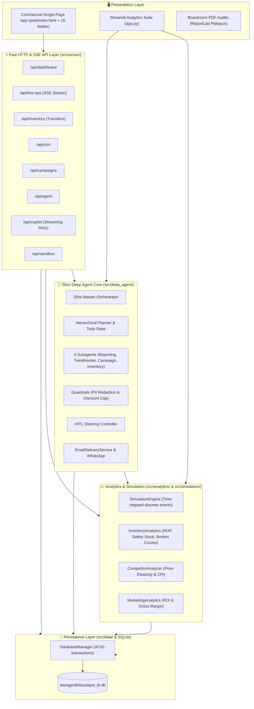
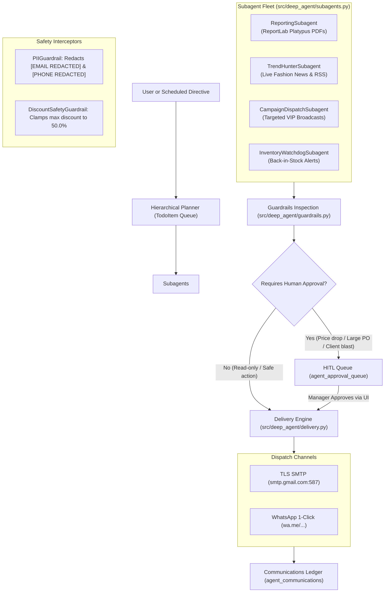

# 🏛️ Mishika Fashion Boutique BI & Shivi Deep Agent Suite
## Master Architecture & Technical Cheatsheet

> **Target Audience**: Software Engineers, Data Scientists, and System Architects.  
> **Repository**: `local_bi_boutique_assistant`  
> **Core Stack**: Python 3.14, FastAPI, SQLite, Plotly, ReportLab Platypus, Local Ollama (Llama 3.2 / Mistral), Vanilla JS/HTML5/CSS3 Atelier SPA, Streamlit.

---

## Table of Contents
1. [Executive Mental Model & Three Pillars](#1-executive-mental-model--three-pillars)
2. [Layered System Architecture](#2-layered-system-architecture)
3. [Business Domain & Mathematical Formulations](#3-business-domain--mathematical-formulations)
4. [Dual-Location Inventory Isolation Model](#4-dual-location-inventory-isolation-model)
5. [Database Schema & Entity-Relationship Dictionary](#5-database-schema--entity-relationship-dictionary)
6. [FastAPI RESTful API Directory](#6-fastapi-restful-api-directory)
7. [Shivi Deep Agent: Subagents, Guardrails & HITL Steering](#7-shivi-deep-agent-subagents-guardrails--hitl-steering)
8. [Discrete-Event POS Simulation Engine](#8-discrete-event-pos-simulation-engine)
9. [Codebase Directory & Component Index](#9-codebase-directory--component-index)
10. [Operational Runbook & Troubleshooting](#10-operational-runbook--troubleshooting)

---

## 1. Executive Mental Model & Three Pillars

The Mishika Boutique platform is built around **Three Operational Pillars**:

```
                       ┌─────────────────────────────────────────────────────────────┐
                       │               MISHIKA BOUTIQUE ARCHITECTURE                 │
                       └──────────────────────────────┬──────────────────────────────┘
                                                      │
         ┌────────────────────────────────────────────┼────────────────────────────────────────────┐
         ▼                                            ▼                                            ▼
┌─────────────────────────────────┐      ┌─────────────────────────────────┐      ┌─────────────────────────────────┐
│       1. DISCRETE-EVENT POS     │      │     2. STATISTICAL ANALYTICS    │      │      3. SHIVI DEEP AGENT        │
│        SIMULATION ENGINE        │      │        & LOCAL BI ENGINE        │      │       AUTONOMOUS SUITE          │
├─────────────────────────────────┤      ├─────────────────────────────────┤      ├─────────────────────────────────┤
│ • Virtual shoppers & footfall   │      │ • Sell-Through Rate (STR)       │      │ • Hierarchical 4-step Planner   │
│ • Competitor price benchmarking │      │ • Reorder Points (ROP) & Z-score│      │ • PII Masking & 50% Discount Cap│
│ • FIFO shop inventory deduction │      │ • Gross Margin & Revenue ledger │      │ • Human-in-the-Loop (HITL) Queue│
│ • Periodic supplier deliveries  │      │ • Category price elasticity     │      │ • Outbound Gmail SMTP & wa.me   │
└─────────────────────────────────┘      └─────────────────────────────────┘      └─────────────────────────────────┘
```

### Why On-Premises?
Unlike generic cloud SaaS, this architecture is **100% on-premises**:
- SQLite runs locally (`storage/db/boutique_bi.db`).
- Large Language Models run locally via **Ollama** (`llama3.2:3b` / `mistral`).
- Zero patron PII or proprietary pricing data is ever transmitted to external cloud inference endpoints.

---

## 2. Layered System Architecture



---

## 3. Business Domain & Mathematical Formulations

### 3.1. Sell-Through Rate (STR)
Quantifies inventory velocity by measuring the proportion of inventory sold relative to total stock received:

$$\text{STR (\%)} = \left( \frac{\text{Units Sold}}{\text{Beginning Inventory} + \text{Units Received}} \right) \times 100$$

- **High STR (> 80%)**: Risk of stockout, broken size curves, and lost revenue.
- **Low STR (< 35%)**: Dead stock; requires promotional campaign markdown.

### 3.2. Statistical Safety Stock ($SS$) & Reorder Point (ROP)
To prevent stockouts during supplier lead times without tying up capital, safety stock is calculated using Gaussian distribution with a 95% cycle-service level ($Z = 1.65$):

$$SS = Z \times \sigma_d \times \sqrt{L}$$

$$\text{ROP} = (\bar{d} \times L) + SS$$

Where:
- $\bar{d}$ = Average daily demand (units/day)
- $\sigma_d$ = Standard deviation of daily demand
- $L$ = Supplier lead time in days (typically 3–5 days)
- $Z = 1.65$ (95% non-stockout probability)

Implemented in [`src/analytics/inventory.py`](file:///c:/Users/akhil/Downloads/local_bi_boutique_assistant/src/analytics/inventory.py).

### 3.3. Category Price Elasticity of Demand ($E_d$)
Measures sales volume sensitivity to price adjustments relative to competitor benchmarks (Zara, Mango, Massimo Dutti):

$$E_d = \frac{\% \Delta Q}{\% \Delta P} = \frac{(Q_2 - Q_1) / Q_1}{(P_2 - P_1) / P_1}$$

- $|E_d| > 1.0$: **Elastic** (Demand drops sharply if price rises; markdowns drive heavy volume).
- $|E_d| < 1.0$: **Inelastic** (Luxury essentials; customers are price-insensitive).

Implemented in [`src/analytics/competitor.py`](file:///c:/Users/akhil/Downloads/local_bi_boutique_assistant/src/analytics/competitor.py).

### 3.4. Gross Profit Margin
$$\text{Gross Margin (\%)} = \left( \frac{\text{Revenue} - \text{COGS}}{\text{Revenue}} \right) \times 100$$

---

## 4. Dual-Location Inventory Isolation Model

Luxury boutiques enforce **strict separation** between display merchandise and backroom storage:

```
┌──────────────────────────────────────┐             ┌──────────────────────────────────────┐
│       SHOP FLOOR (Display Racks)     │             │     WAREHOUSE RESERVE (Backroom)     │
│       Table: size_matrix_stock       │             │       Table: warehouse_stock         │
├──────────────────────────────────────┤             ├──────────────────────────────────────┤
│ • Visible to walk-in shoppers        │             │ • Isolated in sealed cartons         │
│ • POS customer checkout decrements   │   TRANSFER  │ • Supplier truck restocks land here  │
│   exclusively from THIS table!       │ ◄─────────► │ • Invisible to floor shoppers        │
│ • Broken curves trigger floor alerts │             │ • High volume safety reserve         │
└──────────────────────────────────────┘             └──────────────────────────────────────┘
                   │                                                     ▲
                   ▼                                                     │
         Shopper POS Checkout                                   Supplier Purchase Order
       (simulation/engine.py)                                     (data/db_manager.py)
```

### ACID Transfer Guarantees
Moving stock requires calling `db.transfer_stock(product_name, from_loc, to_loc, quantity, size)`:
1. Verifies sufficient units exist at `from_loc`.
2. Decrements source table within an active SQLite transaction.
3. Increments target table.
4. Appends an audit record to `stock_transfers`.
5. Rollbacks entirely if any constraint fails.

---

## 5. Database Schema & Entity-Relationship Dictionary

Located at `storage/db/boutique_bi.db`. Managed by [`src/data/db_manager.py`](file:///c:/Users/akhil/Downloads/local_bi_boutique_assistant/src/data/db_manager.py).

| Table Name | Primary Key | Key Columns | Business Purpose |
|---|---|---|---|
| `products` | `product_id` (TEXT) | `name`, `category`, `retail_price`, `cost_price` | Master 20-item luxury catalog metadata. |
| `size_matrix_stock` | `id` (INTEGER) | `product_id`, `product_name`, `size`, `quantity`, `low_stock_threshold` | Physical Shop Floor inventory available for checkout. |
| `warehouse_stock` | `id` (INTEGER) | `product_id`, `product_name`, `size`, `quantity` | Isolated backroom reserve stock. |
| `sales_ledger` | `transaction_id` (TEXT) | `product_id`, `size`, `quantity`, `price_per_unit`, `cost_per_unit`, `total_revenue`, `gross_profit`, `channel`, `customer_id`, `timestamp` | Historical & simulated POS transaction log. |
| `purchase_ledger` | `po_number` (TEXT) | `product_id`, `quantity_ordered`, `total_cost`, `supplier`, `delivery_status`, `order_date` | Supplier procurement & restock receipts. |
| `stock_transfers` | `id` (INTEGER) | `timestamp`, `product_name`, `from_location`, `to_location`, `quantity`, `size`, `status` | Audit trail for shop floor ⇄ warehouse movements. |
| `customers` | `id` (INTEGER) | `name`, `email`, `phone`, `tier`, `total_spend`, `last_visit`, `birthday`, `opt_in_email` | 20 Seeded VIP patron dossiers and preferences. |
| `campaigns` | `campaign_id` (INTEGER) | `name`, `target_category`, `discount_pct`, `start_date`, `end_date`, `status` | Promotional directives & active store markdowns. |
| `agent_approval_queue`| `id` (INTEGER) | `action_type`, `description`, `payload`, `status`, `created_at`, `reviewed_at`, `reviewed_by` | HITL steering queue for human manager approval. |
| `agent_communications`| `id` (INTEGER) | `timestamp`, `customer_id`, `customer_name`, `channel`, `message_type`, `subject`, `content`, `status` | Dispatch ledger for outbound emails and WhatsApp alerts. |

---

## 6. FastAPI RESTful API Directory

All backend endpoints are prefixed with `/api` and defined across [`src/server/routes/`](file:///c:/Users/akhil/Downloads/local_bi_boutique_assistant/src/server/routes/):

### Dashboard & Analytics (`/api/dashboard`)
- `GET /api/dashboard/kpis`: Live revenue, orders, gross margin %, STR %, and active broken curves.
- `GET /api/dashboard/revenue-trend`: Daily historical sales and margin aggregation.
- `GET /api/dashboard/category-breakdown`: Inventory and revenue contribution across apparel categories.
- `POST /api/dashboard/repricing-sim`: Evaluates revenue and gross profit impact of custom price adjustments.

### Live Operations & Simulation (`/api/live-ops`)
- `GET /api/live-ops/status`: Current simulation state (frame tick, running boolean, active promo, truck arrivals).
- `POST /api/live-ops/tick`: Triggers a single discrete time-step in the simulation engine.
- `POST /api/live-ops/start`: Starts real-time simulation loop.
- `POST /api/live-ops/pause`: Pauses real-time simulation loop.
- `POST /api/live-ops/settings`: Modifies promotional markdown and simulation tick speed.
- `GET /api/live-ops/stream`: **Server-Sent Events (SSE)** channel broadcasting real-time store events.
- `GET /api/live-ops/stock-chart`: Delivers 20-item live stock distribution for ApexCharts.
- `POST /api/live-ops/reset`: Synchronizes in-memory simulation stock directly from SQLite.

### Inventory & Warehouse Portal (`/api/inventory`)
- `GET /api/inventory/overview`: Side-by-side stock comparison (Shop Floor vs. Warehouse) for all sizes.
- `POST /api/inventory/transfer`: Executes ACID transfer of units between Shop Floor and Warehouse Reserve.
- `POST /api/inventory/order`: Places procurement order with suppliers, delivering directly to Warehouse.
- `POST /api/inventory/products`: Creates and registers a new apparel item into the boutique catalog.
- `GET /api/inventory/transfers-ledger`: Historical audit trail of all warehouse transfers.

### VIP Client CRM (`/api/crm`)
- `GET /api/crm/customers`: List of 20 VIP client profiles with spend metrics and loyalty tiers.
- `GET /api/crm/customer/{id}`: Detailed customer dossier with purchase history and preferred sizes.
- `POST /api/crm/customer/{id}`: Updates contact details and communication opt-in channels.
- `GET /api/crm/upcoming-birthdays`: Clients celebrating birthdays within the next 14 days.

### Shivi Deep Agent (`/api/agent`)
- `GET /api/agent/status`: Agent health, skills count, tools count, and active guardrails.
- `POST /api/agent/run-action`: Dispatches operational routines:
  - `morning_opening`: Prepares Morning Briefing PDF & audits.
  - `evening_closing`: Prepares Financial Closing Audit PDF & drawer reconciliation.
  - `fashion_news`: Curates runway trends and drafts personalized client newsletters.
  - `campaign_launch`: Broadcasts marketing incentives.
  - `stock_watchdog`: Identifies replenishment needs.
  - `birthday_concierge`: Prepares VIP celebration gifts.
- `GET /api/agent/news-preview`: Curates trending fashion news from internet feeds with guaranteed fallback.
- `POST /api/agent/send-email`: Single or batch SMTP dispatch to customer inboxes.
- `GET /api/agent/email-config` & `POST /api/agent/email-config`: Loads/saves SMTP credentials and auto-send flags.
- `POST /api/agent/guardrails/redact-pii`: Masks phone numbers and emails.
- `POST /api/agent/guardrails/validate-discount`: Enforces enterprise 50.0% discount ceiling.
- `GET /api/agent/approvals` & `POST /api/agent/approvals/{id}/action`: HITL approval queue review.
- `GET /api/agent/communications`: Audit ledger of all outbound dispatches.

### AI Copilot Studio (`/api/copilot`)
- `POST /api/copilot/chat`: Streaming SSE endpoint providing RAG answers via local Ollama models.
- `GET /api/copilot/models`: Available local Ollama weights (`llama3.2:3b`, `mistral`, etc.).
- `GET /api/copilot/personas`: Strategic personas (Senior Merchandise Director, Inventory Strategist, VIP Concierge).

### Executive Boardroom Reports (`/api/reports`)
- `GET /api/reports/opening-pdf`: Streams official ReportLab Morning Briefing PDF document.
- `GET /api/reports/closing-pdf`: Streams official ReportLab Evening Financial Audit PDF document.
- `GET /api/reports/presentation-pptx`: Generates 16:9 executive boardroom PowerPoint presentation.

---

## 7. Shivi Deep Agent: Subagents, Guardrails & HITL Steering



### Safety Guardrails
1. **PII Guardrail** (`src/deep_agent/guardrails.py`):
   - Regex interceptors mask raw email addresses and phone numbers in prompts and summaries:
   - Example: `john.doe@gmail.com` $\rightarrow$ `[EMAIL REDACTED]`.
2. **Discount Safety Guardrail** (`src/deep_agent/guardrails.py`):
   - Hard cap at **50.0%**. Any agent-suggested markdown above 50% is automatically clamped with a logged warning (`🚨 [GUARDRAIL VIOLATION]`).
3. **AST-Filtered Python Sandbox** (`src/deep_agent/environment.py`):
   - Evaluates ad-hoc Python code in a restricted scope.
   - Forbids `import os`, `sys`, file writes, subprocess execution, or network sockets via Abstract Syntax Tree (AST) node filtering.

---

## 8. Discrete-Event POS Simulation Engine

Located at [`src/simulation/engine.py`](file:///c:/Users/akhil/Downloads/local_bi_boutique_assistant/src/simulation/engine.py).

### How a Simulation Tick Works
```
[Frame Tick N] 
       │
       ├─► 1. Foot Traffic Generation:
       │      Generates 1 to 3 virtual shoppers based on store hour curves.
       │
       ├─► 2. Purchasing Decision:
       │      Shopper evaluates item retail price vs. competitor brand benchmarks (Zara, Mango).
       │      Considers active promotional campaign discount.
       │
       ├─► 3. Inventory Decrement:
       │      Deducts 1 unit from 'size_matrix_stock' (Shop Floor) for the requested size.
       │      If stock == 0, transaction fails and registers a 'Broken Curve'.
       │
       ├─► 4. Financial Ledger Entry:
       │      Appends record to 'sales_ledger' with revenue, cost price, and gross profit.
       │      Attributes purchase to random VIP customer if loyalty member.
       │
       ├─► 5. Supplier Delivery Check:
       │      Periodic delivery trucks arrive and replenish 'warehouse_stock'.
       │
       └─► 6. Real-time Broadcast:
              Emits event payload to SSE stream (/api/live-ops/stream).
```

---

## 9. Codebase Directory & Component Index

```
local_bi_boutique_assistant/
├── src/
│   ├── core/
│   │   ├── constants.py          # Enums: DBTable, StockLocation, ApparelSize, CampaignStatus, etc.
│   │   ├── config.py             # Brand defaults, colors, paths, thresholds
│   │   └── catalog.py            # Master luxury products registry & inventory generator
│   │
│   ├── simulation/
│   │   ├── engine.py             # SimulationEngine, shopper logic, FIFO checkout
│   │   └── customer_profiles.py  # VIP customer personas & spending distributions
│   │
│   ├── data/
│   │   ├── db_manager.py         # DatabaseManager: 40+ ACID methods for SQLite
│   │   └── seed_db.py            # Initial schema setup & seed data generators
│   │
│   ├── analytics/
│   │   ├── inventory.py          # Safety stock, ROP, broken curves, turnover
│   │   ├── competitor.py         # Elasticity, competitor price indexing (CPI)
│   │   ├── marketing.py          # Campaign margin impact & customer retention
│   │   └── sentiment.py          # 4-Pillar customer feedback sentiment scoring
│   │
│   ├── deep_agent/
│   │   ├── orchestrator.py       # ShiviDeepAgent: Opening, Closing, and Coordination
│   │   ├── planner.py            # HierarchicalPlanner: Goal decomposition & TodoItems
│   │   ├── subagents.py          # Reporting, TrendHunter, Campaign, Inventory subagents
│   │   ├── guardrails.py         # PIIGuardrail, DiscountSafetyGuardrail (50% max)
│   │   ├── steering.py           # HumanInTheLoopController (Approval Queue)
│   │   ├── environment.py        # PythonSandbox with AST safety filter
│   │   └── delivery.py           # EmailDeliveryService (SMTP) & WhatsAppDeliveryService
│   │
│   ├── ai/
│   │   └── ollama_client.py      # Local Ollama RAG streaming client
│   │
│   └── server/
│       ├── app.py                # FastAPI app setup, CORS, SSE, static mounts
│       └── routes/               # Modular route controllers (dashboard, live_ops, etc.)
│
├── web/
│   ├── index.html                # Modern luxury SPA structure
│   ├── css/style.css             # Glassmorphic atelier design system
│   └── js/
│       ├── api.js                # Frontend HTTP & SSE client
│       ├── charts.js             # ApexCharts visualizers
│       ├── tour.js               # Interactive in-UI Guided Architecture Tour
│       └── app.js                # Core SPA state machine & reactive bindings
│
├── app.py                        # Streamlit multi-tab analytical interface
├── run_saas.py                   # Commercial web application launcher (FastAPI on :8000)
└── run_tests.py                  # Automated test suite (32 unit & integration tests)
```

---

## 10. Operational Runbook & Troubleshooting

### How to Start the Modern Web Application (Recommended)
```powershell
.\.venv\Scripts\python.exe run_saas.py
```
- Opens `http://localhost:8000` in your default browser.
- Interactive API documentation available at `http://localhost:8000/docs`.

### How to Start the Streamlit Analytics Suite
```powershell
.\.venv\Scripts\python.exe -m streamlit run app.py
```
- Available at `http://localhost:8501`.

### How to Run Automated Unit Tests
```powershell
.\.venv\Scripts\python.exe run_tests.py
```
- Executes all 32 unit and integration tests across database, simulation, routes, and agent routines.
- Unit tests run in a fully mocked sandbox and **never** send real emails to live external inboxes.

### Managing Email Dispatch
- **Automated sends**: Controlled by `auto_send_admin_audits` and `auto_send_customer_emails` in `storage/config/email_config.json` and `.env`.
- **To prevent all automated emails**: Set both flags to `false`.
- **To disconnect SMTP entirely**: Set `"is_configured": false` in `email_config.json`.
